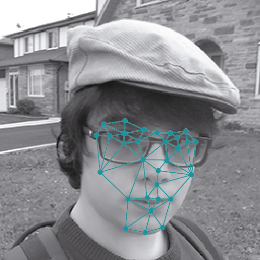
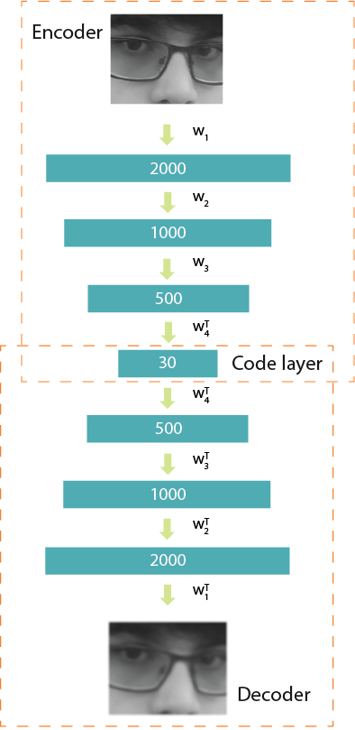
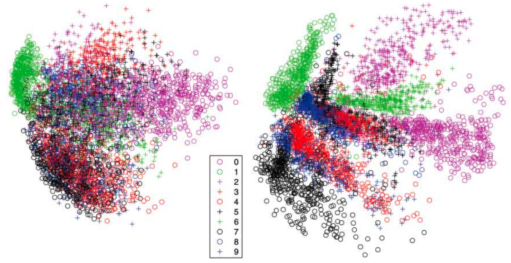

# AutoEncoders

 

## Dependencies

## Introduction

An autoencoder, also known as autoassociator or Diabolo networks, is an artificial neural network employed to recreate the given input.
It takes a set of <b>unlabeled</b> inputs, encodes them and then tries to extract the most valuable information from them.
They are used for feature extraction, learning generative models of data, dimensionality reduction and can be used for compression. 

A 2006 paper named <b><a href="https://www.cs.toronto.edu/~hinton/science.pdf">Reducing the Dimensionality of Data with Neural Networks</a>, done by G. E. Hinton and R. R. Salakhutdinov</b>, showed better results than years of refining other types of network, and was a breakthrough in the field of Neural Networks, a field that was "stagnant" for 10 years.

Now, autoencoders, based on Restricted Boltzmann Machines, are employed in some of the largest deep learning applications. They are the building blocks of Deep Belief Networks (DBN).

	

### Feature Extraction and Dimensionality Reduction

An example given by Nikhil Buduma in KdNuggets (<a href="http://www.kdnuggets.com/2015/03/deep-learning-curse-dimensionality-autoencoders.html">link</a>) which gave an excellent explanation of the utility of this type of Neural Network.

Say that you want to extract what emotion the person in a photography is feeling. Using the following 256x256 pixel grayscale picture as an example:

	

But when use this picture we start running into a bottleneck! Because this image being 256x256 pixels in size correspond with an input vector of 65536 dimensions! If we used an image produced with conventional cellphone cameras, that generates images of 4000 x 3000 pixels, we would have 12 million dimensions to analyze.

	

This bottleneck is further problematized as the difficulty of a machine learning problem is increased as more dimensions are involved. According to a 1982 study by C.J. Stone (<a href="http://www-personal.umich.edu/~jizhu/jizhu/wuke/Stone-AoS82.pdf">link</a>), the time to fit a model, is optimal if:

**m-p/(2p+d)**

Where: 
m: Number of data points 
d: Dimensionality of the data 
p: Parameter that depends on the model

As you can see, it increases exponentially!
Returning to our example, we don't need to use all of the 65,536 dimensions to classify an emotion. A human identify emotions according to some specific facial expression, some <b>key features</b>, like the shape of the mouth and eyebrows.

### Autoencoder Structure

	

An autoencoder can be divided in two parts, the <b>encoder</b> and the <b>decoder</b>.

The encoder needs to compress the representation of an input. In this case we are going to reduce the dimension the face of our actor, from 2000 dimensions to only 30 dimensions, by running the data through layers of our encoder.

The decoder works like encoder network in reverse. It works to recreate the input, as closely as possible. This plays an important role during training, because it forces the autoencoder to select the most important features in the compressed representation.

### Performance

After the training has been done, you can use the encoded data as a reliable dimensionally-reduced data, applying it to any problems where dimensionality reduction seems appropriate.

	

This image was extracted from the G. E. Hinton and R. R. Salakhutdinovcomparing's <a href="https://www.cs.toronto.edu/~hinton/science.pdf">paper</a>, on the two-dimensional reduction for 500 digits of the MNIST, with PCA on the left and autoencoder on the right. We can see that the autoencoder provided us with a better separation of data.

### Training: Loss function

An autoencoder uses the Loss function to properly train the network. The Loss function will calculate the differences between our output and the expected results. After that, we can minimize this error with gradient descent. There are more than one type of Loss function, it depends on the type of data.

#### Binary Values:

**l(f(x)) = - Σk (xk log (x'k) + (1 - xk) log(1 - x'k))**

For binary values, we can use an equation based on the sum of Bernoulli's cross-entropy. 

xk is one of our inputs and x'k is the respective output.

We use this function so that if xk equals to one, we want to push x'k as close as possible to one. The same if xk equals to zero.

If the value is one, we just need to calculate the first part of the formula, that is, -xk log(x'k). Which, turns out to just calculate -log(x'k).

And if the value is zero, we need to calculate just the second part, (1 - xk) log (1 - x'k)) - which turns out to be log (1 - x'k).

#### Real values:

**l(f(x)) = -½Σk(x'k - xk)²**

As the above function would behave badly with inputs that are not 0 or 1, we can use the sum of squared differences for our Loss function. If you use this loss function, it's necessary that you use a linear activation function for the output layer.

As it was with the above example, xk is one of our inputs and x'k is the respective output, and we want to make our output as similar as possible to our input.

#### Loss Gradient:

**∇a'(xt) l(f(x(t)))  = x't - xt**

We use the gradient descent to reach the local minimum of our function l(f(x(t))), taking steps towards the negative of the gradient of the function in the current point.

Our function about the gradient ∇a'(xt) of the loss of l(f(x(t))) in the preactivation of the output layer.

It's actually a simple formula, it is done by calculating the difference between our output x't and our input xt.

Then our network backpropagates our gradient ∇a'(xt) l(f(x(t))) through the network using <b>backpropagation</b>.

Head [Here](Notebook.ipynb) to see the code.

## Thanks for Reading :)