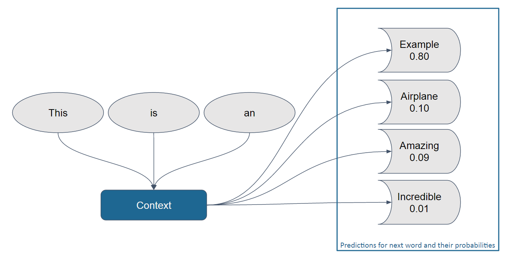
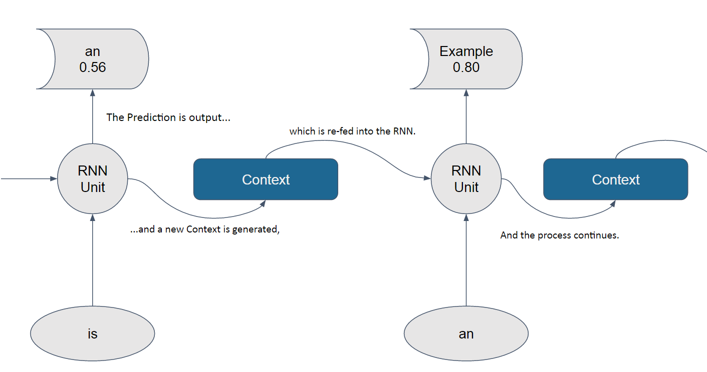
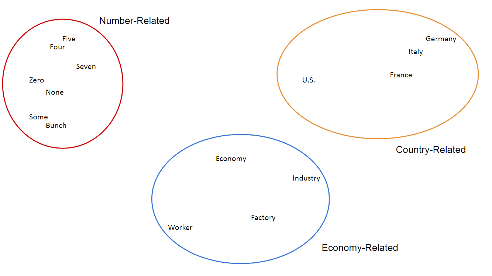

# LSTM Language Modelling

 

## Dependencies

## Introduction

Language Modelling, to put it simply, <b>is the task of assigning probabilities to sequences of words</b>. This means that, given a context of one or a sequence of words in the language the model was trained on, the model should provide the next most probable words or sequence of words that follows from the given sequence of words the sentence. Language Modelling is one of the most important tasks in Natural Language Processing.

	
	Example of a sentence being predicted

In this example, one can see the predictions for the next word of a sentence, given the context "This is an". As you can see, this boils down to a sequential data analysis task -- you are given a word or a sequence of words (the input data), and, given the context (the state), you need to find out what is the next word (the prediction). This kind of analysis is very important for language-related tasks such as <b>Speech Recognition, Machine Translation, Image Captioning, Text Correction</b> and many other very relevant problems. 

	
	The above example is a schema of an RNN in execution

As the above image shows, Recurrent Network models fit this problem like a glove. Alongside LSTM and its capacity to maintain the model's state for over one thousand time steps, we have all the tools we need to undertake this problem. The goal for this notebook is to create a model that can reach <b>low levels of perplexity</b> on our desired dataset.

For Language Modelling problems, <b>perplexity</b> is the way to gauge efficiency. Perplexity is simply a measure of how well a probabilistic model is able to predict its sample. A higher-level way to explain this would be saying that <b>low perplexity means a higher degree of trust in the predictions the model makes</b>. Therefore, the lower perplexity is, the better.

### The Penn Treebank dataset

Historically, datasets big enough for Natural Language Processing are hard to come by. This is in part due to the necessity of the sentences to be broken down and tagged with a certain degree of correctness -- or else the models trained on it won't be able to be correct at all. This means that we need a <b>large amount of data, annotated by or at least corrected by humans</b>. This is, of course, not an easy task at all.

The Penn Treebank, or PTB for short, is a dataset maintained by the University of Pennsylvania. It is <i>huge</i> -- there are over <b>four million and eight hundred thousand</b> annotated words in it, all corrected by humans. It is composed of many different sources, from abstracts of Department of Energy papers to texts from the Library of America. Since it is verifiably correct and of such a huge size, the Penn Treebank is commonly used as a benchmark dataset for Language Modelling.

The dataset is divided in different kinds of annotations, such as Piece-of-Speech, Syntactic and Semantic skeletons. For this example, we will simply use a sample of clean, non-annotated words (with the exception of one tag --<code>&lt;unk&gt;</code>
, which is used for rare words such as uncommon proper nouns) for our model. This means that we just want to predict what the next words would be, not what they mean in context or their classes on a given sentence.

### Word Embeddings

For better processing, in this example, we will make use of <a href="https://www.tensorflow.org/tutorials/word2vec/"><b>word embeddings</b></a>, which is <b>a way of representing sentence structures or words as n-dimensional vectors (where n is a reasonably high number, such as 200 or 500) of real numbers</b>. Basically, we will assign each word a randomly-initialized vector, and input those into the network to be processed. After a number of iterations, these vectors are expected to assume values that help the network to correctly predict what it needs to -- in our case, the probable next word in the sentence. This is shown to be a very effective task in Natural Language Processing, and is a commonplace practice.

<strong>Vec("Example") = [0.02, 0.00, 0.00, 0.92, 0.30, ...]</strong>

Word Embedding tends to group up similarly used words <i>reasonably</i> close together in the vectorial space. For example, if we use T-SNE (a dimensional reduction visualization algorithm) to flatten the dimensions of our vectors into a 2-dimensional space and plot these words in a 2-dimensional space, we might see something like this:

	
	T-SNE Mockup with clusters marked for easier visualization

As you can see, words that are frequently used together, in place of each other, or in the same places as them tend to be grouped together -- being closer together the higher they are correlated. For example, "None" is pretty semantically close to "Zero", while a phrase that uses "Italy", you could probably also fit "Germany" in it, with little damage to the sentence structure. The vectorial "closeness" for similar words like this is a great indicator of a well-built model.

Head [Here](Notebook.ipynb) to see the code.

## Thanks for Reading :)