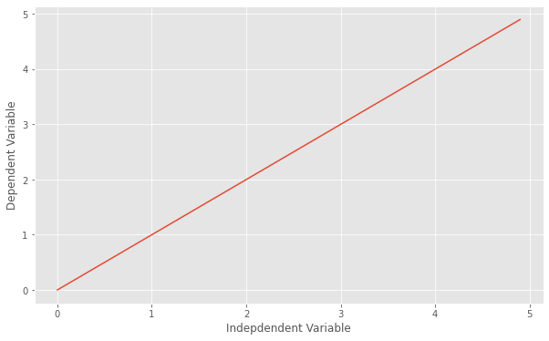

# Linear Regression

 

## Dependencies

## Introduction

Defining a `linear regression` in simple terms, is the approximation of a linear model used to describe the relationship between two or more variables. In a simple linear regression there are two variables, the dependent variable, which can be seen as the "state" or "final goal" that we study and try to predict, and the independent variables, also known as explanatory variables, which can be seen as the "causes" of the "states". 

When more than one independent variable is present the process is called multiple linear regression.  
When multiple dependent variables are predicted the process is known as multivariate linear regression.

The equation of a simple linear model is **Y = a X + b**

Where Y is the dependent variable and X is the independent variable, and <b>a</b> and <b>b</b> being the parameters we adjust. <b>a</b> is known as "slope" or "gradient" and <b>b</b> is the "intercept". You can interpret this equation as Y being a function of X, or Y being dependent on X.

If you plot the model, you will see it is a line, and by adjusting the "slope" parameter you will change the angle between the line and the independent variable axis, and the "intercept parameter" will affect where it crosses the dependent variable's axis.

OK... but how can we see this concept of linear relations with a more meaningful point of view?

Simple linear relations were used to try to describe and quantify many observable physical phenomena, the easiest to understand are speed and distance traveled:

<b>Distance Traveled = Speed \times Time + Initial Distance

Speed = Acceleration \times Time + Initial Speed</b>

They are also used to describe properties of different materials:  

<b>Force = Deformation \times Stiffness

Heat Transfered = Temperature Difference \times Thermal Conductivity

Electrical Tension (Voltage) = Electrical Current \times Resistance

Mass =  Volume \times Density</b>

When we perform an experiment and gather the data, or if we already have a dataset and we want to perform a linear regression, what we will do is adjust a simple linear model to the dataset, we adjust the "slope" and "intercept" parameters to the data the best way possible, because the closer the model comes to describing each ocurrence, the better it will be at representing them.

So how is this "regression" performed? Head [Here](Notebook.ipynb) to see the code.

## Thanks for Reading :)