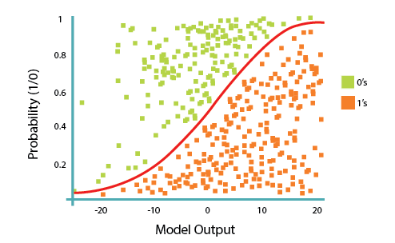

# Logistic Regression

 

## Dependencies

##  Introduction

While Linear Regression is suited for estimating continuous values (e.g. estimating house price), it is not the best tool for predicting the class in which an observed data point belongs. In order to provide estimate for classification, we need some sort of guidance on what would be the <b>most probable class</b> for that data point. For this, we use <b>Logistic Regression</b>.

<strong>Recall linear regression:</strong>

Linear regression finds a function that relates a continuous dependent variable, <i>y</i>, to some predictors (independent variables <i>x1</i>, <i>x2</i>, etc.). Simple linear regression assumes a function of the form:
y = w0 + w1 × x1 + w2 × x2 + ...

and finds the values of <i>w0</i>, <i>w1</i>, <i>w2</i>, etc. The term <i>w0</i> is the "intercept" or "constant term" (it's shown as <i>b</i> in the formula):
Y = W X + b

Logistic Regression is a variation of Linear Regression, useful when the observed dependent variable, <i>y</i>, is categorical. It produces a formula that predicts the probability of the class label as a function of the independent variables.

Despite the name logistic <i>regression</i>, it is actually a <b>probabilistic classification</b> model. Logistic regression fits a special s-shaped curve by taking the linear regression and transforming the numeric estimate into a probability with the following function:

**Probability Of a Class = ʘ(y) = exp(y) / (1 + exp(y)) = p**

which produces p-values between 0 (as y approaches minus infinity **-∞**) and 1 (as y approaches plus infinity **+∞**). This now becomes a special kind of non-linear regression.

In this equation, <i>y</i> is the regression result (the sum of the variables weighted by the coefficients), <code>exp</code> is the exponential function and **ʘ(y)** is the <a href="http://en.wikipedia.org/wiki/Logistic_function">logistic function</a>, also called logistic curve. It is a common "S" shape (sigmoid curve), and was first developed for modeling population growth.

You might also have seen this function before, in another configuration:

**Probability Of a Class = ʘ(y) = 1 / (1 + exp(-y))**

So, briefly, Logistic Regression passes the input through the logistic/sigmoid function but then treats the result as a probability:

So how is this "regression" performed? Head [Here](Notebook.ipynb) to see the code.

## Thanks for Reading :)