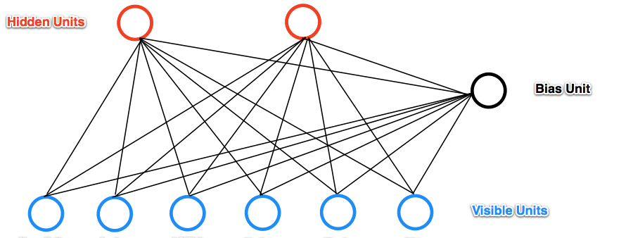

# Restricted Boltzmann Machines (RBMs)

 

## Dependencies

## Introduction

**Restricted Boltzmann Machine (RBM):**  RBMs are shallow neural nets that learn to reconstruct data by themselves in an unsupervised fashion.  

<h4>Why are RBMs important?</h4>

It can automatically extract <b>meaningful</b> features from a given input.

<h4>How does it work?</h4>

RBM is a 2 layer neural network. Simply, RBM takes the inputs and translates those into a set of binary values that represents them in the hidden layer. Then, these numbers can be translated back to reconstruct the inputs. Through several forward and backward passes, the RBM will be trained, and a trained RBM can reveal which features are the most important ones when detecting patterns.   

<h4>What are the applications of RBM?</h4>

RBM is useful for <a href='http://www.cs.utoronto.ca/~hinton/absps/netflixICML.pdf'>  Collaborative Filtering</a>, dimensionality reduction, classification, regression, feature learning, topic modeling and even <b>Deep Belief Networks</b>.

<h4>Is RBM a generative or Discriminative model?</h4>

RBM is a generative model. Let me explain it by first, see what is different between discriminative and generative models: 

<b>Discriminative:</b> Consider a classification problem in which we want to learn to distinguish between Sedan cars (y = 1) and SUV cars (y = 0), based on some features of cars. Given a training set, an algorithm like logistic regression tries to find a straight line—that is, a decision boundary—that separates the suv and sedan.  
<b>Generative:</b> looking at cars, we can build a model of what Sedan cars look like. Then, looking at SUVs, we can build a separate model of what SUV cars look like. Finally, to classify a new car, we can match the new car against the Sedan model, and match it against the SUV model, to see whether the new car looks more like the SUV or Sedan. 

Generative Models specify a probability distribution over a dataset of input vectors. We can do both supervise and unsupervised tasks with generative models:
<ul>
    <li>In an unsupervised task, we try to form a model for P(x), where P is the probability given x as an input vector.</li>
    <li>In the supervised task, we first form a model for P(x|y), where P is the probability of x given y(the label for x). For example, if y = 0 indicates whether a car is a SUV or y = 1 indicates indicate a car is a Sedan, then p(x|y = 0) models the distribution of SUVs’ features, and p(x|y = 1) models the distribution of Sedans’ features. If we manage to find P(x|y) and P(y), then we can use <code>Bayes rule</code> to estimate P(y|x), because: **p(y|x) = p(x|y)p(y) / p(x)**</li>
</ul>

Now the question is, can we build a generative model, and then use it to create synthetic data by directly sampling from the modeled probability distributions?

### RBM layers

An RBM has two layers. The first layer of the RBM is called the <b>visible</b> (or input layer). Imagine that our toy example, has only vectors with 7 values, so the visible layer must have j=7 input nodes. 
The second layer is the <b>hidden</b> layer, which possesses i neurons in our case. Each hidden node can have either 0 or 1 values (i.e., si = 1 or si = 0) with a probability that is a logistic function of the inputs it receives from the other j visible units, called for example, p(si = 1). For our toy sample, we'll use 2 nodes in the hidden layer, so i = 2.

Each node in the first layer also has a <b>bias</b>. We will denote the bias as “v_bias” for the visible units. The <b>v_bias</b> is shared among all visible units.

### What RBM can do after training?
    
Think RBM as a model that has been trained based on images of a dataset of many SUV and Sedan cars. Also, imagine that the RBM network has only two hidden nodes, one for the weight and, and one for the size of cars, which in a sense, their different configurations represent different cars, one represent SUV cars and one for Sedan. In a training process, through many forward and backward passes, RBM adjust its weights to send a stronger signal to either the SUV node (0, 1) or the Sedan node (1, 0) in the hidden layer, given the pixels of images. Now, given a SUV in hidden layer, which distribution of pixels should we expect? RBM can give you 2 things. First, it encodes your images in hidden layer. Second, it gives you the probability of observing a case, given some hidden values.

<h3>How to inference?</h3>

RBM has two phases:
<ul>
    <li>Forward Pass</li>  
    <li>Backward Pass or Reconstruction</li>
</ul>

<b>Phase 1) Forward pass:</b>  Input one training sample (one image) <b>X</b> through all visible nodes, and pass it to all hidden nodes. Processing happens in each node in the hidden layer. This computation begins by making stochastic decisions about whether to transmit that input or not (i.e. to determine the state of each hidden layer). At the hidden layer's nodes, <b>X</b> is multiplied by a <b>Wij</b> and added to <b>houtput, p(hj)</b>, where j is the unit number. 

**p(hj)= σ(Σi w_ij xi)**, where σ() is the logistic function.

Now lets see what p(hj) represents. In fact, it is the probabilities of the hidden units. And, all values together are called <b>probability distribution</b>. That is, RBM uses inputs x to make predictions about hidden node activations. For example, imagine that the values of hp for the first training item is [0.51 0.84]. It tells you what is the conditional probability for each hidden neuron to be at Phase 1): 
<ul>
    <li>p(h_1 = 1|V) = 0.51</li>
    <li>(h_2 = 1|V) = 0.84</li>  
</ul>
As a result, for each row in the training set, <b>a vector/tensor</b> is generated, which in our case it is of size [1x2], and totally n vectors (p(h)=[nx2]). We then turn unit hj on with probability p(hj|V), and turn it off with probability 1 - p(hj|V).

Therefore, the conditional probability of a configuration of h given v (for a training sample) is:

**p(h|v) = H∏j=0 p(hj|V)**

Now, sample a hidden activation vector <b>h</b> from this probability distribution **p(hj)**. That is, we sample the activation vector from the probability distribution of hidden layer values. 

<b>Phase 2) Backward Pass (Reconstruction):</b>
The RBM reconstructs data by making several forward and backward passes between the visible and hidden layers.

So, in the second phase (i.e. reconstruction phase), the samples from the hidden layer (i.e. h) play the role of input. That is, <b>h</b> becomes the input in the backward pass. The same weight matrix and visible layer biases are used to go through the sigmoid function. The produced output is a reconstruction which is an approximation of the original input.

<h3>How to train the model?</h3>

<b>Warning!!</b> The following part discuss how to train the model which needs some algebra background. Still, you can skip this part and run the next cells.

As mentioned, we want to give a high probability to the input data we train on. So, in order to train an RBM, we have to maximize the product of probabilities assigned to all rows v (images) in the training set V (a matrix, where each row of it is treated as a visible vector v):

Which is equivalent, maximizing the expected log probability of V:

So, we have to update the weights wij  to increase p(v) for all v in our training data during training. So we have to calculate the derivative:

∂ log p(v) / ∂ wij

This cannot be easily done by typical <b>gradient descent (SGD)</b>, so we can use another approach, which has 2 steps:
<ol>
    <li>Gibbs Sampling</li>
    <li>Contrastive Divergence</li>
</ol>    
    
<h3>Gibbs Sampling</h3>  

First, given an input vector v we are using p(h|v) for prediction of the hidden values h. 
<ul>
    <li>p(h|v) = sigmoid(X ⨂ W + hb)</li>
    <li>h0 = sampleProb(h0)</li>
</ul>
    
Then, knowing the hidden values, we use p(v|h) for reconstructing of new input values v. 
<ul>
    <li>p(v|h) = sigmoid(h0 ⨂ transpose(W) + vb)</li>
    <li>v1 = sampleProb(v1)  (Sample v given h)</li>
</ul>
        
This process is repeated k times. After k iterations we obtain an other input vector vk which was recreated from original input values v0 or X.

Reconstruction steps:
<ul>
    <li> Get one data point from data set, like <i>x</i>, and pass it through the net</li>
    <li>Pass 0: (x)  ⇒ (h0) ⇒ (v1)   (v1 is reconstruction of the first pass)</li>
    <li>Pass 1: (v1) ⇒ (h1) ⇒ (v2)   (v2 is reconstruction of the second pass)</li>
    <li>Pass 2: (v2) ⇒ (h2) ⇒ (v3)   (v3 is reconstruction of the third pass)</li>
    <li>Pass n: (vk) ⇒ (hk+1) ⇒ (vk+1)   (vk is reconstruction of the nth pass)</li>
</ul>
        
<h4>What is sampling here (sampleProb)?</h4>

In forward pass: We randomly set the values of each hi to be 1 with probability sigmoid(v ⨂ W + hb).  
- To sample h given v means to sample from the conditional probability distribution P(h|v). It means that you are asking what are the probabilities of getting a specific set of values for the hidden neurons, given the values v for the visible neurons, and sampling from this probability distribution. 
In reconstruction: We randomly set the values of each vi to be 1 with probability sigmoid(h ⨂ transpose(W) + vb).

<h3>contrastive divergence (CD-k)</h3>

The update of the weight matrix is done during the Contrastive Divergence step. 

Vectors v0 and vk are used to calculate the activation probabilities for hidden values h0 and hk. The difference between the outer products of those probabilities with input vectors v0 and vk results in the update matrix:

ΔW =v0 ⨂ h0 - vk ⨂ hk

Contrastive Divergence is actually matrix of values that is computed and used to adjust values of the W matrix. Changing W incrementally leads to training of W values. Then on each step (epoch), W is updated to a new value W' through the equation below:

W' = W + alpha * ΔW

 
<b>What is Alpha?</b>  
Here, alpha is some small step rate and is also known as the "learning rate".

Head [Here](Notebook.ipynb) to see the code.

## Thanks for Reading :)