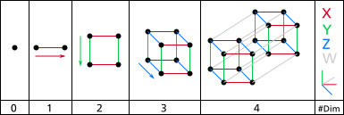

# TensorFlow Basics

 

## Dependencies

<h2>How does TensorFlow work?</h2>

TensorFlow defines computations as Graphs, and these are made with operations (also know as “ops”). So, when we work with TensorFlow, it is the same as defining a series of operations in a Graph.

To execute these operations as computations, we must launch the Graph into a Session. The session translates and passes the operations represented into the graphs to the device you want to execute them on, be it a GPU or CPU. In fact, TensorFlow's capability to execute the code on different devices such as CPUs and GPUs is a consequence of it's specific structure.

For example, the image below represents a graph in TensorFlow. <b>W</b>, <b>x</b> and b are tensors over the edges of this graph. <b>MatMul</b> is an operation over the tensors <b>W</b> and <b>x</b>, after that <b>Add</b> is called and add the result of the previous operator with <b>b</b>. The resultant tensors of each operation cross the next one until the end where it's possible to get the wanted result.

<h3>What is the meaning of Tensor?</h3>

<strong>In TensorFlow all data is passed between operations in a computation graph, and these are passed in the form of Tensors, hence the name of TensorFlow.</strong>

The word <b>tensor</b> from new latin means "that which stretches". It is a mathematical object that is named "tensor" because an early application of tensors was the study of materials stretching under tension. The contemporary meaning of tensors can be taken as multidimensional arrays.

That's great, but... what are these multidimensional arrays? 

Going back a little bit to physics to understand the concept of dimensions:

The zero dimension can be seen as a point, a single object or a single item.

The first dimension can be seen as a line, a one-dimensional array can be seen as numbers along this line, or as points along the line. One dimension can contain infinite zero dimension/points elements.

The second dimension can be seen as a surface, a two-dimensional array can be seen as an infinite series of lines along an infinite line. 

The third dimension can be seen as volume, a three-dimensional array can be seen as an infinite series of surfaces along an infinite line.

The Fourth dimension can be seen as the hyperspace or spacetime, a volume varying through time, or an infinite series of volumes along an infinite line. And so forth on...

As mathematical objects:

### Summarizing:

<table>
	<tr>
		<td><b>Dimension</b></td>
		<td><b>Physical Representation</b></td> 
		<td><b>Mathematical Object</b></td>
		<td><b>In Code</b></td>
	</tr>
	<tr>
		<td>Zero </td>
		<td>Point</td> 
		<td>Scalar (Single Number)</td>
		<td>[ 1 ]</td>
	</tr>
	<tr>
		<td>One</td>
		<td>Line</td> 
		<td>Vector (Series of Numbers) </td>
		<td>[ 1,2,3,4,... ]</td>
	</tr>
	<tr>
		<td>Two</td>
		<td>Surface</td> 
		<td>Matrix (Table of Numbers)</td>
		<td>[ [1,2,3,4,...], [1,2,3,4,...], [1,2,3,4,...],... ]</td>
	</tr>
	<tr>
		<td>Three</td>
		<td>Volume</td> 
		<td>Tensor (Cube of Numbers)</td>
		<td>[ [[1,2,...], [1,2,...], [1,2,...],...], [[1,2,...], [1,2,...], [1,2,...],...], [[1,2,...], [1,2,...], [1,2,...] ,...]... ]</td>
	</tr>
</table>

<h2>Why Tensors?</h2>

The Tensor structure helps us by giving the freedom to shape the dataset in the way we want.

And it is particularly helpful when dealing with images, due to the nature of how information in images are encoded,

Thinking about images, its easy to understand that it has a height and width, so it would make sense to represent the information contained in it with a two dimensional structure (a matrix)... until you remember that images have colors, and to add information about the colors, we need another dimension, and thats when Tensors become particularly helpful.

Images are encoded into color channels, the image data is represented into each color intensity in a color channel at a given point, the most common one being RGB, which means Red, Blue and Green. The information contained into an image is the intensity of each channel color into the width and height of the image, just like this:

So the intensity of the red channel at each point with width and height can be represented into a matrix, the same goes for the blue and green channels, so we end up having three matrices, and when these are combined they form a tensor. 

### Variables

Now that we are more familiar with the structure of data, we will take a look at how TensorFlow handles variables.
<b>First of all, having tensors, why do we need variables?</b>  
TensorFlow variables are used to share and persistent some stats that are manipulated by our program. That is, when you define a variable, TensorFlow adds a <b>tf.Operation</b> to your graph. Then, this operation will store a writable tensor value that persists between tf.Session.run calls. So, you can update the value of a variable through each run, while you cannot update tensor (e.g a tensor created by tf.constant()) through multiple runs in a session. 

<b>How to define a variable?</b>  
To define variables we use the command <b>tf.Variable()</b>.
To be able to use variables in a computation graph it is necessary to initialize them before running the graph in a session. This is done by running <b>tf.global_variables_initializer()</b>.

### Placeholders

Now we know how to manipulate variables inside TensorFlow graph, but what about feeding data outside of a TensorFlow graph? 

If you want to feed data to a TensorFlow graph from outside a graph, you will need to use placeholders.

So <b>what are these placeholders and what do they do?</b> 

Placeholders can be seen as "holes" in your model, "holes" which you will pass the data to, you can create them using   <b>tf.placeholder(_datatype_)</b>, where <b>_datatype_</b> specifies the type of data (integers, floating points, strings, booleans) along with its precision (8, 16, 32, 64) bits.

The definition of each data type with the respective python syntax is defined as:

|Data type	|Python type|Description|
| --------- | --------- | --------- |
|DT_FLOAT	|tf.float32	|32 bits floating point.|
|DT_DOUBLE	|tf.float64	|64 bits floating point.|
|DT_INT8	|tf.int8	|8 bits signed integer.|
|DT_INT16	|tf.int16	|16 bits signed integer.|
|DT_INT32	|tf.int32	|32 bits signed integer.|
|DT_INT64	|tf.int64	|64 bits signed integer.|
|DT_UINT8	|tf.uint8	|8 bits unsigned integer.|
|DT_STRING	|tf.string	|Variable length byte arrays. Each element of a Tensor is a byte array.|
|DT_BOOL	|tf.bool	|Boolean.|
|DT_COMPLEX64	|tf.complex64	|Complex number made of two 32 bits floating points: real and imaginary parts.|
|DT_COMPLEX128	|tf.complex128	|Complex number made of two 64 bits floating points: real and imaginary parts.|
|DT_QINT8	|tf.qint8	|8 bits signed integer used in quantized Ops.|
|DT_QINT32	|tf.qint32	|32 bits signed integer used in quantized Ops.|
|DT_QUINT8	|tf.quint8	|8 bits unsigned integer used in quantized Ops.|

### Operations

Operations are nodes that represent the mathematical operations over the tensors on a graph. These operations can be any kind of functions, like add and subtract tensor or maybe an activation function.

<b>tf.constant</b>, <b>tf.matmul</b>, <b>tf.add</b>, <b>tf.nn.sigmoid</b> are some of the operations in TensorFlow. These are like functions in python but operate directly over tensors and each one does a specific thing. 
Other operations can be easily found in: <a href="https://www.tensorflow.org/versions/r0.9/api_docs/python/index.html">https://www.tensorflow.org/versions/r0.9/api_docs/python/index.html</a>

### References:

https://www.tensorflow.org/versions/r0.9/get_started/index.html 
http://jrmeyer.github.io/tutorial/2016/02/01/TensorFlow-Tutorial.html 
https://www.tensorflow.org/versions/r0.9/api_docs/python/index.html 
<a href="https://www.tensorflow.org/api_docs/python/">https://www.tensorflow.org/versions/r0.9/resources/dims_types.html</a> 
https://en.wikipedia.org/wiki/Dimension 
https://book.mql4.com/variables/arrays 
https://msdn.microsoft.com/en-us/library/windows/desktop/dn424131(v=vs.85).aspx 

Head [Here](Notebook.ipynb) to see the code.

## Thanks for Reading :)