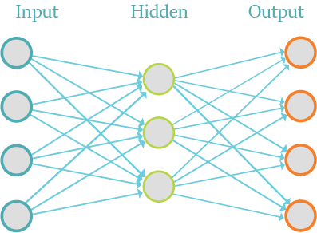

	

	
	
	
	
	
	
	
	

## About the Repo

This repository contains code for various Deep Learning concepts implemented using TensorFlow. Following are the links for the same. 

<h3>

	
 TensorFlow Basics

	<table>
		<th><a href="Code/TensorFlow%20Basics">Visit Directory ↗</a></th>
		<th></th>
	</table>

</h3>
<h3>

	
 Linear Regression

	<table>
		<th><a href="Code/Linear%20Regression">Visit Directory ↗</a></th>
		<th></th>
	</table>

</h3>
<h3>

	
 Logistic Regression

	<table>
		<th><a href="Code/Logistic%20Regression">Visit Directory ↗</a></th>
		<th></th>
	</table>

</h3>
<h3>

	
 Convolutional Neural Networks CNNs

	<table>
		<th><a href="Code/CNN">Visit Directory ↗</a></th>
	</table>

</h3>
<h3>

	
 LSTM Basics

	<table>
		<th><a href="Code/LSTM%20Basics">Visit Directory ↗</a></th>
		<th></th>
	</table>

</h3>
<h3>

	
 LSTM Language Modelling

	<table>
		<th><a href="Code/LSTM%20Language%20Modelling">Visit Directory ↗</a></th>
		<th></th>
	</table>

</h3>
<h3>

	
 Restricted BoltzMann Machines RBMs

	<table>
		<th><a href="Code/RBM">Visit Directory ↗</a></th>
		<th></th>
	</table>

</h3>
<h3>

	
 AutoEncoders

	<table>
		<th><a href="Code/AutoEncoders">Visit Directory ↗</a></th>
		<th></th>
	</table>

</h3>

## Thanks for Reading :)

[MIT License](LICENSE)

Copyright (c) 2021, Code rights belongs to the original creators. 

Author - [Tarun Kamboj](https://github.com/Tarun-Kamboj).